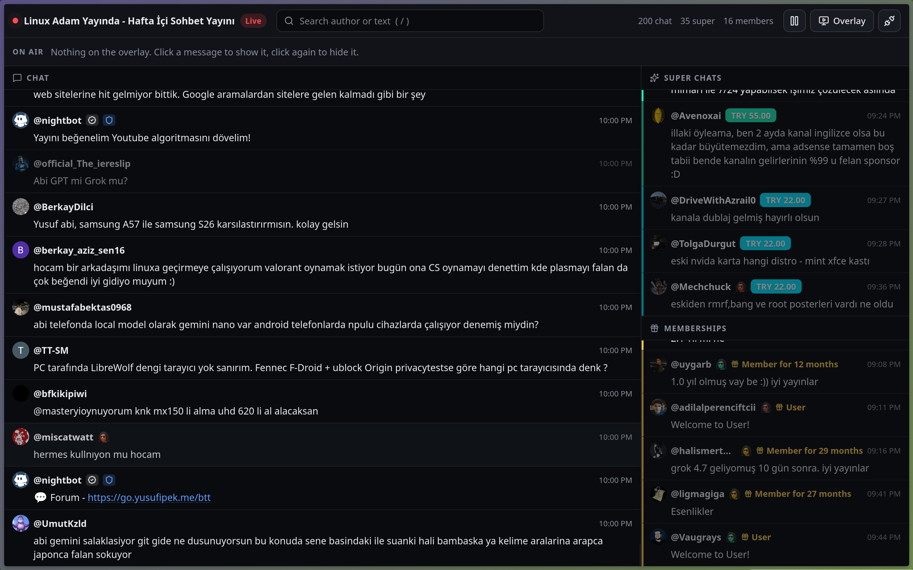

# YTChatHub



Open-source YouTube Live chat client for streamers. Watch the chat in a fast dashboard, click a message and it appears on an OBS browser-source overlay. Super Chats, super stickers, memberships, gifted memberships, badges, custom emojis and the chat leaderboard are all shown. Long links in chat arrive with their full URL, not the truncated text YouTube displays.

## Running it

Requires Node.js 20+ and pnpm.

```bash
pnpm install
pnpm build
pnpm start
```

Open `http://localhost:4100`, paste the live stream URL or video id, and add the overlay URL from the dashboard's Overlay button as an OBS Browser Source. The overlay's theme, position, size, animation and auto-hide are set in that URL, so different sources can look different. The Show page (`/show/`) drives a countdown, a like goal, a sponsor card with a QR code, a now-playing card (run `scripts/now-playing.py <music folder>` on the OBS machine; it reads the track OBS's VLC source has open) and an end screen with credits, each its own browser source; the countdown can switch OBS scenes at zero if its source has "Advanced access to OBS" page permission.

`pnpm dev` runs the backend on 4100 and the Next.js client on 3100 with hot reload. Optional environment variables: `YOUTUBE_LIVE_ID` connects at startup, `PORT` and `HOST` change where the backend listens (it binds to 127.0.0.1 by default), `MOCK_CHAT=1` generates fake messages when nothing is connected, `SHOW_DATA_DIR` moves the saved show settings and sponsor logo out of `data/`.

Keyboard: `/` focuses search, `P` pauses the chat, `Esc` clears the overlay.

## Stack

Fastify backend with [youtubei.js](https://github.com/LuanRT/YouTube.js) for chat ingestion, one WebSocket for messages, selection and connection status, and a Next.js static export served by the same backend. Chat runs entirely on your machine; YouTube CDN images are proxied and cached locally so OBS never hits rate limits.
